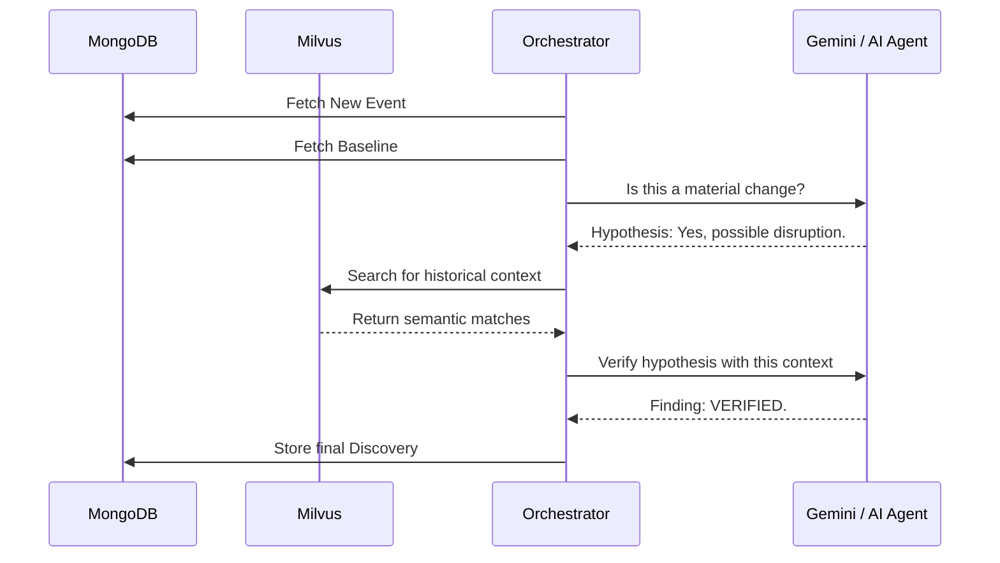

# RAG, AI Agents, & Gemini Orchestration

> [!TIP]
> This document details how **Retrieval-Augmented Generation (RAG)** and frontier AI models (like Gemini) are orchestrated via the Antigravity architecture to empower the investigation engine.

## 1. The Role of RAG (Retrieval-Augmented Generation)

In Unknown Intelligence, RAG is **not** used to build a chatbot that answers user questions over documents. Instead, RAG is an internal tool utilized by the AI agents to locate evidence for hypotheses.

- **Storage**: Unstructured text, documents, and historical context are chunked, embedded, and stored in **Milvus** (`pymilvus`).
- **Semantic Search**: When the Investigation Engine needs to test a hypothesis (e.g., "Has this supplier been late before?"), it performs semantic search against Milvus to retrieve historically similar events or contradictory claims.
- **Evidence Cross-referencing**: The retrieved semantic chunks are then cross-referenced against the structured metadata and provenance stored in MongoDB to ensure accuracy.

## 2. Agentic Orchestration (`orchestrator.py`)

The system uses bounded agentic workflows powered by models like Gemini. The orchestrator coordinates subagents to handle specific segments of the discovery pipeline.

### Agentic Stages:
1. **Stage A - Bounded Investigation**: The AI is strictly limited to specific, safe retrieval tools (fetching vectors or MongoDB records) to verify a pre-generated hypothesis.
2. **Stage B - Multi-step Reasoning**: The model is permitted to iterate, retrieve additional evidence, and compute findings.
3. **Stage C - Continuous Monitoring**: Agents run in the background via `start.ps1`, periodically analyzing new events streaming into the database.

> [!CAUTION]
> The orchestrator strictly forbids agents from performing **unauthorized execution** or actions outside of the investigation sandbox. The focus is entirely on verifying the evidence and assigning a confidence score.

## 3. Gemini & Antigravity Integration

The use of frontier models (like Gemini 1.5 Pro) allows the system to process massive context windows. 

When the Significance Filter passes a complex scenario, the orchestrator packages the retrieved Milvus vectors, the MongoDB structured events, and the statistical baseline data into a unified context prompt. 

Gemini acts as the ultimate **Synthesis Engine**, performing the final logical contradiction check. If it determines the anomaly is material, a `Finding` is generated and saved via the Motor driver back to the UI.

## 4. Development & Tuning

To tune these models, developers use `dataset/train.ipynb` to generate clean synthetic examples of anomalies and expected behavior. This notebook creates the evaluation framework required to benchmark the agents.

